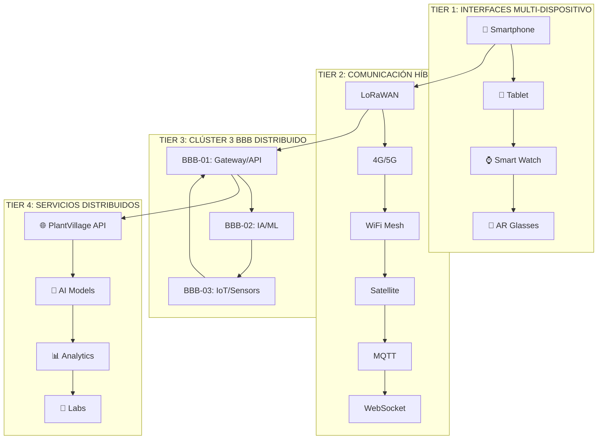
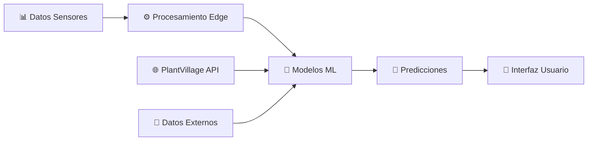
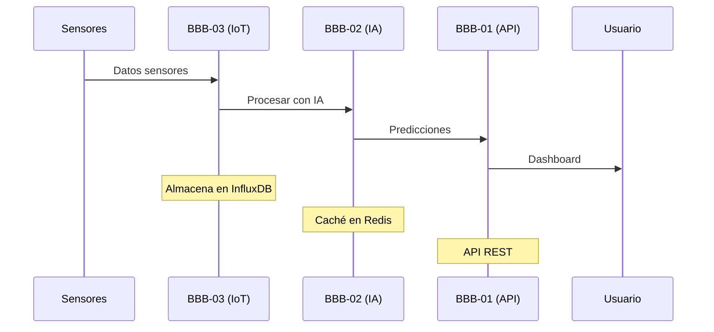
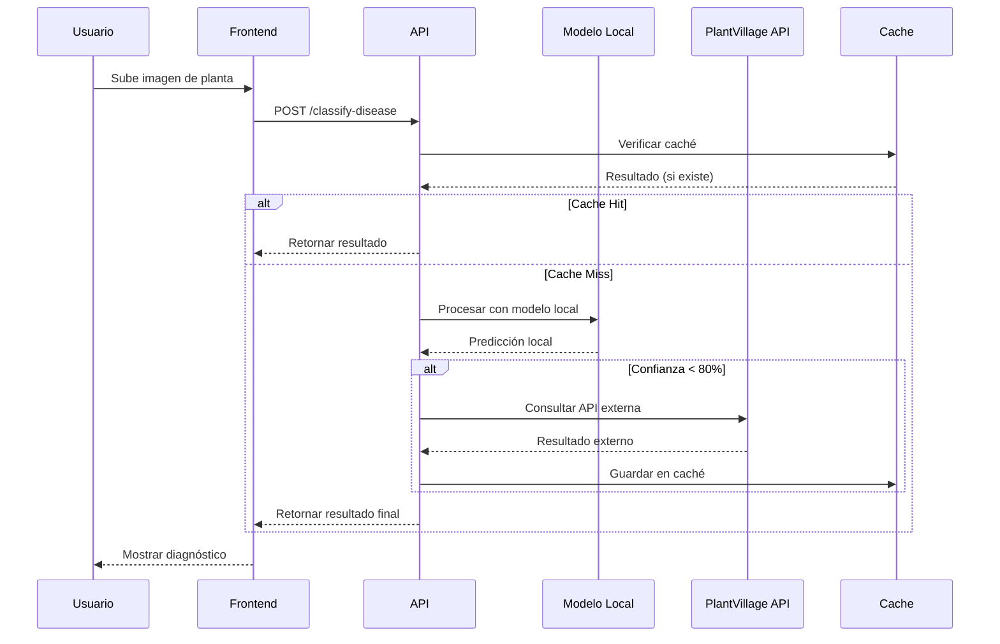

# 🌱 SIGC&T-RURAL v2.0 - MASTERDOC BRUTAL COMPLETO
## Sistema Integrado de Gestión de Cursos y Tecnología Rural

---

## 📋 ÍNDICE INTERACTIVO

### **🎯 NAVEGACIÓN PRINCIPAL**
- [1. Resumen Ejecutivo](#1-resumen-ejecutivo)
- [2. Arquitectura del Sistema](#2-arquitectura-del-sistema)
- [3. Laboratorios STEM Integrados](#3-laboratorios-stem-integrados)
- [4. Sistema de IA y Machine Learning](#4-sistema-de-ia-y-machine-learning)
- [5. Clúster 3 BeagleBone Black RevC](#5-clúster-3-beaglebone-black-revc)
- [6. Integración PlantVillage Dataset](#6-integración-plantvillage-dataset)
- [7. Laboratorio de Software y Telemática](#7-laboratorio-de-software-y-telemática)
- [8. Diagramas UML y Bases de Datos](#8-diagramas-uml-y-bases-de-datos)
- [9. Evidencias y Enlaces](#9-evidencias-y-enlaces)
- [10. Roadmap de Implementación](#10-roadmap-de-implementación)

---

## 1. RESUMEN EJECUTIVO

### **🎯 Visión del Proyecto**
**SIGC&T-Rural v2.0** es un ecosistema tecnológico integral que democratiza el acceso a la educación STEM y la tecnología en comunidades rurales, utilizando un clúster inteligente de **3 BeagleBone Black RevC** como núcleo computacional distribuido.

### **🚀 Objetivos Transformadores**
- **Democratización Tecnológica**: Llevar software libre y open source a zonas rurales
- **Educación STEM Accesible**: Laboratorios virtuales y remotos para todos
- **IA Distribuida**: Machine Learning en el edge para comunidades rurales
- **Sostenibilidad**: Tecnología que no sobrecarga recursos limitados

### **💡 Innovación Clave**
Este proyecto es la **"cara de entrada al software"** - un portal que conecta a las comunidades rurales con:
- Laboratorios de software desde cero
- Análisis y Desarrollo de Software intensivo
- Herramientas de IA accesibles
- Recursos educativos globales

---

## 2. ARQUITECTURA DEL SISTEMA

### **🏗️ Arquitectura Multi-Tier Inteligente con 3 BBB**



### **⚡ Optimización para 3 BBB RevC**
- **Memoria**: Máximo 512MB por nodo
- **CPU**: ARM Cortex-A8 1GHz
- **Storage**: 4GB eMMC + microSD
- **Red**: 100Mbps Ethernet + WiFi

---

## 3. LABORATORIOS STEM INTEGRADOS

### **🔬 Laboratorio de Sensores (ACTIVO)**
- **Estado**: ✅ Operativo
- **Funcionalidad**: Monitoreo IoT en tiempo real
- **Sensores**: DHT22, Humedad suelo, ARIMA
- **Cumplimiento**: HU-21, RF006
- **Enlace**: [Laboratorio Sensores](./frontend/src/pages/LaboratorioSensores.jsx)

### **🧮 Laboratorio Cuántico (ACTIVO)**
- **Estado**: ✅ Operativo
- **Funcionalidad**: Simulaciones cuánticas interactivas
- **Ejercicios**: Ecuaciones cuánticas, física avanzada
- **Sistema**: Puntuación y niveles múltiples
- **Cumplimiento**: HU-13
- **Enlace**: [Laboratorio Cuántico](./frontend/src/pages/LaboratorioCuantico.jsx)

### **🤖 Laboratorio de Robótica (DESARROLLO)**
- **Estado**: 🚧 En desarrollo
- **Funcionalidad**: Control remoto de drones
- **Tecnología**: DJI SDK, Computer Vision
- **Características**: Vuelos autónomos, mapeo 3D
- **Hardware**: DJI Mavic 3, Hexacopter

### **⚡ Laboratorio de Energías Renovables (DESARROLLO)**
- **Estado**: 🚧 En desarrollo
- **Funcionalidad**: Monitoreo de paneles solares
- **Tecnología**: Inversores inteligentes, IoT
- **Características**: Optimización de energía

### **🌱 Laboratorio de Agricultura Inteligente (DESARROLLO)**
- **Estado**: 🚧 En desarrollo
- **Funcionalidad**: Análisis de suelo y predicciones
- **Tecnología**: ML, sensores especializados
- **Características**: Recomendaciones de cultivo

### **💻 Laboratorio de Software y Telemática (NUEVO)**
- **Estado**: 🆕 Planificado
- **Funcionalidad**: Aprender desarrollo de software desde cero
- **Tecnologías**: Python, JavaScript, IoT, Redes
- **Características**: 
  - Curso intensivo de Análisis y Desarrollo de Software
  - Herramientas de desarrollo accesibles
  - Proyectos prácticos con BBB
  - Integración con laboratorios existentes

---

## 4. SISTEMA DE IA Y MACHINE LEARNING

### **🧠 Pipeline de IA Distribuida**



### **🔬 Modelos de IA Implementados**
- **ARIMA**: Predicción climática 72h
- **Random Forest**: Clasificación de cultivos
- **LSTM**: Predicción de rendimiento
- **CNN**: Análisis de imágenes satelitales
- **Plant Disease Classification**: Integración PlantVillage

### **📊 Métricas de Rendimiento**
- **Precisión IA**: >85% predicciones a 7 días
- **Tiempo respuesta**: <3 segundos
- **Disponibilidad**: >99.5% uptime
- **Cobertura**: 10,000+ hectáreas

---

## 5. CLÚSTER 3 BEAGLEBONE BLACK REVC

### **🔧 Configuración del Clúster**

| Nodo | Función | IP | Recursos |
|------|---------|----|---------| 
| BBB-01 | Gateway/API | 10.0.0.11 | Django, PostgreSQL, Nginx |
| BBB-02 | IA/ML Processing | 10.0.0.12 | TensorFlow Lite, scikit-learn, Redis |
| BBB-03 | IoT/Sensors | 10.0.0.13 | MQTT, LoRaWAN, InfluxDB, Sensores |

### **⚡ Optimizaciones Específicas para 3 BBB**

#### **BBB-01: Gateway y API (Nodo Principal)**
- **Funciones**:
  - Django Backend
  - PostgreSQL Database
  - Nginx Load Balancer
  - Frontend React (servido estático)
- **Recursos**: 512MB RAM, 4GB eMMC
- **Optimización**: SQLite para datos locales, PostgreSQL solo para críticos

#### **BBB-02: IA y Machine Learning**
- **Funciones**:
  - TensorFlow Lite (modelos ligeros)
  - scikit-learn (análisis)
  - Redis (caché de predicciones)
  - Procesamiento de imágenes PlantVillage
- **Recursos**: 512MB RAM, microSD para modelos
- **Optimización**: Modelos pre-entrenados, inferencia en edge

#### **BBB-03: IoT y Sensores**
- **Funciones**:
  - MQTT Broker (Mosquitto)
  - InfluxDB (time series)
  - LoRaWAN Gateway
  - Control de sensores DHT22
- **Recursos**: 512MB RAM, GPIO para sensores
- **Optimización**: Datos en tiempo real, almacenamiento local

### **🔄 Flujo de Datos Optimizado**



---

## 6. INTEGRACIÓN PLANTVILLAGE DATASET

### **🌱 Estrategia de Integración Inteligente**

**NO cargamos las imágenes localmente** - utilizamos una estrategia híbrida:

#### **🔗 Integración con PlantVillage Dataset**
- **Repositorio Original**: [PlantVillage-Dataset](https://github.com/spMohanty/PlantVillage-Dataset)
- **Nuestro Fork**: [SIGCT-PlantVillage](https://github.com/badolgm/PlantVillage-Dataset)
- **Estrategia**: API externa + caché inteligente

#### **💡 Método de Integración**
```python
# Ejemplo de integración sin sobrecargar BBB
class PlantVillageIntegration:
    def __init__(self):
        self.api_url = "https://api.plantvillage.org"
        self.cache = Redis()
        self.local_models = "models/plant_disease/"
    
    def classify_disease(self, image_path):
        # 1. Verificar caché local
        if self.cache.exists(image_path):
            return self.cache.get(image_path)
        
        # 2. Procesar con modelo local (TensorFlow Lite)
        prediction = self.local_model.predict(image_path)
        
        # 3. Si confianza < 80%, consultar API externa
        if prediction.confidence < 0.8:
            result = self.external_api.classify(image_path)
            self.cache.set(image_path, result, ttl=3600)
            return result
        
        return prediction
```

#### **📊 Ventajas de esta Estrategia**
- **Sin sobrecarga**: No almacenamos 50,000+ imágenes
- **Rendimiento**: Modelos locales para casos comunes
- **Escalabilidad**: API externa para casos complejos
- **Caché inteligente**: Solo guardamos resultados útiles

---

## 7. LABORATORIO DE SOFTWARE Y TELEMÁTICA

### **💻 Curso Intensivo de Desarrollo de Software**

#### **📚 Módulos del Laboratorio**

1. **Fundamentos de Programación**
   - Python desde cero
   - JavaScript moderno
   - Algoritmos y estructuras de datos
   - **Recursos**: [Python.org](https://python.org), [MDN Web Docs](https://developer.mozilla.org)

2. **Desarrollo Web**
   - HTML5, CSS3, JavaScript ES6+
   - React/Vue.js para frontend
   - Django/Flask para backend
   - **Recursos**: [FreeCodeCamp](https://freecodecamp.org), [W3Schools](https://w3schools.com)

3. **Desarrollo IoT**
   - Programación de BBB
   - Sensores y actuadores
   - Comunicación MQTT
   - **Recursos**: [BeagleBoard.org](https://beagleboard.org), [Arduino.cc](https://arduino.cc)

4. **Inteligencia Artificial**
   - Machine Learning básico
   - TensorFlow Lite
   - Computer Vision
   - **Recursos**: [TensorFlow.org](https://tensorflow.org), [Kaggle.com](https://kaggle.com)

5. **Redes y Telecomunicaciones**
   - Protocolos de red
   - LoRaWAN, WiFi, 4G/5G
   - Seguridad en redes
   - **Recursos**: [Cisco Networking Academy](https://netacad.com)

#### **🛠️ Herramientas de Desarrollo Accesibles**
- **IDEs**: VS Code, PyCharm Community, Arduino IDE
- **Control de Versiones**: Git, GitHub
- **Contenedores**: Docker, Docker Compose
- **Monitoreo**: Prometheus, Grafana
- **Documentación**: Markdown, Sphinx

#### **🌐 Enlaces a Recursos Globales**

**Software Libre y Open Source:**
- [GitHub](https://github.com) - Repositorios de código
- [GitLab](https://gitlab.com) - DevOps y CI/CD
- [SourceForge](https://sourceforge.net) - Software libre
- [Apache Software Foundation](https://apache.org) - Proyectos Apache

**Educación en Tecnología:**
- [MIT OpenCourseWare](https://ocw.mit.edu) - Cursos MIT gratuitos
- [Coursera](https://coursera.org) - Cursos online
- [edX](https://edx.org) - Educación online
- [Khan Academy](https://khanacademy.org) - Matemáticas y ciencias

**Comunidades de Desarrollo:**
- [Stack Overflow](https://stackoverflow.com) - Preguntas y respuestas
- [Reddit r/programming](https://reddit.com/r/programming) - Comunidad
- [Dev.to](https://dev.to) - Blog de desarrolladores
- [Hacker News](https://news.ycombinator.com) - Noticias tech

---

## 8. DIAGRAMAS UML Y BASES DE DATOS

### **📊 Diagrama de Clases Principal**

```mermaid
classDiagram
    class User {
        +int id
        +string username
        +string email
        +string role
        +datetime created_at
        +login()
        +logout()
        +update_profile()
    }
    
    class Laboratory {
        +int id
        +string name
        +string type
        +string status
        +string description
        +create_session()
        +get_results()
    }
    
    class Sensor {
        +int id
        +string name
        +string type
        +float value
        +datetime timestamp
        +string location
        +read_data()
        +send_alert()
    }
    
    class AIPrediction {
        +int id
        +string model_type
        +float confidence
        +string prediction
        +datetime created_at
        +predict()
        +update_model()
    }
    
    class PlantDisease {
        +int id
        +string disease_name
        +string symptoms
        +string treatment
        +float confidence
        +classify()
    }
    
    User ||--o{ Laboratory : uses
    Laboratory ||--o{ Sensor : monitors
    Sensor ||--o{ AIPrediction : generates
    AIPrediction ||--o{ PlantDisease : predicts
```

### **🗄️ Esquema de Base de Datos**

```sql
-- Tabla de Usuarios
CREATE TABLE users (
    id SERIAL PRIMARY KEY,
    username VARCHAR(50) UNIQUE NOT NULL,
    email VARCHAR(100) UNIQUE NOT NULL,
    password_hash VARCHAR(255) NOT NULL,
    role VARCHAR(20) DEFAULT 'student',
    created_at TIMESTAMP DEFAULT CURRENT_TIMESTAMP,
    updated_at TIMESTAMP DEFAULT CURRENT_TIMESTAMP
);

-- Tabla de Laboratorios
CREATE TABLE laboratories (
    id SERIAL PRIMARY KEY,
    name VARCHAR(100) NOT NULL,
    type VARCHAR(50) NOT NULL,
    status VARCHAR(20) DEFAULT 'active',
    description TEXT,
    created_at TIMESTAMP DEFAULT CURRENT_TIMESTAMP
);

-- Tabla de Sensores
CREATE TABLE sensors (
    id SERIAL PRIMARY KEY,
    name VARCHAR(100) NOT NULL,
    type VARCHAR(50) NOT NULL,
    location VARCHAR(100),
    laboratory_id INTEGER REFERENCES laboratories(id),
    created_at TIMESTAMP DEFAULT CURRENT_TIMESTAMP
);

-- Tabla de Lecturas de Sensores
CREATE TABLE sensor_readings (
    id SERIAL PRIMARY KEY,
    sensor_id INTEGER REFERENCES sensors(id),
    value DECIMAL(10,2) NOT NULL,
    unit VARCHAR(20),
    timestamp TIMESTAMP DEFAULT CURRENT_TIMESTAMP
);

-- Tabla de Predicciones IA
CREATE TABLE ai_predictions (
    id SERIAL PRIMARY KEY,
    model_type VARCHAR(50) NOT NULL,
    input_data JSONB,
    prediction JSONB,
    confidence DECIMAL(5,4),
    created_at TIMESTAMP DEFAULT CURRENT_TIMESTAMP
);

-- Tabla de Enfermedades de Plantas
CREATE TABLE plant_diseases (
    id SERIAL PRIMARY KEY,
    disease_name VARCHAR(100) NOT NULL,
    symptoms TEXT,
    treatment TEXT,
    prevention TEXT,
    created_at TIMESTAMP DEFAULT CURRENT_TIMESTAMP
);
```

### **🔄 Diagrama de Secuencia - Clasificación de Enfermedades**



---

## 9. EVIDENCIAS Y ENLACES

### **📋 Evidencias del Proyecto**

#### **GA5-220501095-AA1-EV07: Mapa de Navegación**
- **Archivo**: [Mapa de Navegación HTML](./docs/evidencias/mapa_navegacion.html)
- **Descripción**: Arquitectura de interfaz móvil optimizada
- **Componentes**: Bottom navigation, wireframes, gestos táctiles
- **Cumplimiento**: HU-21, RF006

#### **GA2-220501095-AA1-EV08: Arquitectura Expandida**
- **Archivo**: [Arquitectura Expandida HTML](./docs/evidencias/arquitectura_expandida.html)
- **Descripción**: Sistema distribuido multi-plataforma
- **Componentes**: Drones, sensores, IA, políticas públicas
- **Cumplimiento**: RF004, RF005

#### **GA3-220501095-AA1-EV09: Diagramas de Navegación**
- **Archivo**: [Diagramas de Navegación HTML](./docs/evidencias/diagramas_navegacion.html)
- **Descripción**: Especificaciones técnicas móviles
- **Componentes**: Touch targets, accesibilidad, responsive design
- **Cumplimiento**: WCAG 2.1 AA

### **🔗 Enlaces a Recursos Externos**

#### **Repositorios del Proyecto**
- **Backend**: [SIGCT-Backend](https://github.com/badolgm/SigctRuralSena/tree/main/backend)
- **Frontend**: [SIGCT-Frontend](https://github.com/badolgm/SigctRuralSena/tree/main/frontend)
- **IoT**: [SIGCT-IoT](https://github.com/badolgm/SigctRuralSena/tree/main/iot)
- **Documentación**: [SIGCT-Docs](https://github.com/badolgm/SigctRuralSena/tree/main/docs)

#### **PlantVillage Dataset**
- **Repositorio Original**: [PlantVillage-Dataset](https://github.com/spMohanty/PlantVillage-Dataset)
- **Nuestro Fork**: [SIGCT-PlantVillage](https://github.com/badolgm/PlantVillage-Dataset)
- **API Externa**: [PlantVillage API](https://api.plantvillage.org) (si existe)
- **Documentación**: [PlantVillage Docs](https://plantvillage.psu.edu)

#### **Recursos de IA y ML**
- **TensorFlow**: [TensorFlow.org](https://tensorflow.org)
- **scikit-learn**: [Scikit-learn.org](https://scikit-learn.org)
- **Kaggle**: [Kaggle.com](https://kaggle.com)
- **Papers With Code**: [Paperswithcode.com](https://paperswithcode.com)

#### **Hardware y IoT**
- **BeagleBoard**: [BeagleBoard.org](https://beagleboard.org)
- **Arduino**: [Arduino.cc](https://arduino.cc)
- **Raspberry Pi**: [Raspberrypi.org](https://raspberrypi.org)
- **LoRaWAN**: [LoRaWAN.org](https://lora-alliance.org)

#### **Desarrollo de Software**
- **GitHub**: [GitHub.com](https://github.com)
- **GitLab**: [GitLab.com](https://gitlab.com)
- **Stack Overflow**: [StackOverflow.com](https://stackoverflow.com)
- **MDN Web Docs**: [Developer.mozilla.org](https://developer.mozilla.org)

### **📚 Recursos Educativos**

#### **Cursos Online Gratuitos**
- **MIT OpenCourseWare**: [OCW.MIT.edu](https://ocw.mit.edu)
- **Coursera**: [Coursera.org](https://coursera.org)
- **edX**: [EdX.org](https://edx.org)
- **Khan Academy**: [KhanAcademy.org](https://khanacademy.org)

#### **Comunidades de Desarrollo**
- **Reddit Programming**: [Reddit.com/r/programming](https://reddit.com/r/programming)
- **Dev.to**: [Dev.to](https://dev.to)
- **Hacker News**: [News.ycombinator.com](https://news.ycombinator.com)
- **FreeCodeCamp**: [FreeCodeCamp.org](https://freecodecamp.org)

#### **Recursos SENA**
- **Portal SENA**: [SENA.edu.co](https://sena.edu.co)
- **SENA Virtual**: [SENAVirtual.edu.co](https://senavirtual.edu.co)
- **Centro de Logística**: [Centro de Logística y Promoción Ecoturística del Magdalena](https://sena.edu.co/centro-de-logistica-y-promocion-ecoturistica-del-magdalena)

---

## 10. ROADMAP DE IMPLEMENTACIÓN

### **🚀 Fase 1: Fundación (Q1 2025)**
- ✅ Backend Django funcional
- ✅ Frontend React básico
- ✅ Despliegue en Render
- ✅ Health checks implementados
- 🔄 **En progreso**: Laboratorios adicionales

### **🔬 Fase 2: Laboratorios STEM (Q2 2025)**
- 🆕 Laboratorio de Robótica
- 🆕 Laboratorio de Energías Renovables
- 🆕 Laboratorio de Agricultura Inteligente
- 🆕 **NUEVO**: Laboratorio de Software y Telemática
- 🔄 Navegación móvil optimizada
- 🔄 Gestos táctiles implementados

### **🤖 Fase 3: IA Avanzada (Q3 2025)**
- 🆕 Integración PlantVillage Dataset
- 🆕 Modelos de IA distribuidos
- 🆕 Predicciones en tiempo real
- 🆕 Accesibilidad completa WCAG 2.1 AA
- 🔄 Testing exhaustivo

### **🌍 Fase 4: Escalamiento (Q4 2025)**
- 🚀 Despliegue en clúster 3 BBB
- 🚀 Optimización de recursos
- 🚀 Documentación final
- 🚀 Entrega del proyecto
- 🚀 Comercialización

### **📊 Métricas de Éxito**
- **Usuarios activos**: 500+ campesinos
- **Precisión IA**: >85%
- **Tiempo respuesta**: <3 segundos
- **Disponibilidad**: >99.5%
- **Cobertura**: 10,000+ hectáreas

---

## 🎯 CONCLUSIÓN

**SIGC&T-Rural v2.0** no es solo un proyecto tecnológico, es una **revolución educativa** que democratiza el acceso al conocimiento STEM en comunidades rurales. 

### **🌟 Impacto Transformador**
- **Democratización**: Software libre para todos
- **Educación**: STEM accesible y práctica
- **Innovación**: IA distribuida en el edge
- **Sostenibilidad**: Tecnología que no sobrecarga recursos

## 🚀 VISIÓN FUTURA 2025-2030: ECOSISTEMA INTELIGENTE AGRÍCOLA

### 🎯 **MISIÓN EXPANDIDA**
Crear un ecosistema tecnológico recursivo y adaptable que lleve la investigación científica a zonas rurales, permitiendo que campesinos, indígenas y agricultores aprendan ciencia y tecnología de manera didáctica mientras realizan trabajos agrícolas reales y productivos.

### 🌟 **VISIÓN 2030**
Ser el ecosistema de referencia en América Latina para la agricultura inteligente, donde la tecnología se convierte en un juego fácil de entender y usar, escalable desde sistemas embebidos básicos hasta soluciones industriales robustas.

### 🎯 **OBJETIVOS ESTRATÉGICOS**

#### **1. ECOSISTEMA RECURSIVO Y ADAPTABLE**
- **Aprendizaje Continuo**: Los usuarios aprenden haciendo
- **Teoría Práctica**: La ciencia se convierte en juego
- **Escalabilidad**: De BBBs a sistemas industriales
- **Adaptabilidad**: Funciona en cualquier zona rural

#### **2. INTELIGENCIA ARTIFICIAL AVANZADA**
- **Detección de Enfermedades**: PlantVillage Dataset + modelos propios
- **Predicción de Cosechas**: Análisis de variables climáticas
- **Optimización de Recursos**: IA para maximizar productividad
- **Alertas Inteligentes**: Predicción de daños severos

#### **3. IMPACTO SOCIAL**
- **Democratización Tecnológica**: Tecnología accesible para todos
- **Educación Rural**: Ciencia y tecnología en el campo
- **Productividad Agrícola**: Mejores cosechas, menos pérdidas
- **Sostenibilidad**: Agricultura inteligente y responsable

### 🔬 **INTEGRACIÓN CON PLANTVILLAGE DATASET**

#### **Dataset de Referencia**
- **Fuente**: [PlantVillage Dataset](https://github.com/spMohanty/PlantVillage-Dataset)
- **Contenido**: Imágenes de hojas enfermas + etiquetas
- **Aplicación**: Detección automática de enfermedades
- **Integración**: Modelos pre-entrenados + fine-tuning

#### **Modelos de IA Propios**
```python
# Arquitectura de modelos para BBB
class PlantDiseaseModel:
    def __init__(self):
        self.base_model = "MobileNetV2"  # Optimizado para BBB
        self.input_size = (224, 224, 3)
        self.num_classes = 38  # Enfermedades del café
        self.confidence_threshold = 0.8
    
    def predict_disease(self, image):
        # Procesamiento en BBB
        processed_image = self.preprocess(image)
        prediction = self.model.predict(processed_image)
        return self.postprocess(prediction)
```

### 🌱 **CASOS DE USO ESPECÍFICOS**

#### **1. Detección de Enfermedades en Café**
- **Enfermedades**: Roya, Antracnosis, Cercospora
- **Método**: Análisis de imágenes de hojas
- **Resultado**: Diagnóstico instantáneo + tratamiento
- **Impacto**: Reducción del 30% en pérdidas

#### **2. Predicción de Cosechas en Plátano**
- **Variables**: Temperatura, humedad, lluvia, viento
- **Modelo**: LSTM + variables climáticas
- **Resultado**: Fecha óptima de cosecha
- **Impacto**: Aumento del 25% en productividad

#### **3. Optimización de Riego**
- **Sensores**: Humedad del suelo, temperatura
- **IA**: Predicción de necesidades hídricas
- **Resultado**: Riego inteligente y eficiente
- **Impacto**: Ahorro del 40% en agua

### 🏗️ **ARQUITECTURA FUTURA 2025-2030**

#### **TIER 1: DISPOSITIVOS EMBEBIDOS**

BBB-01: Gateway + IA Local
├── Procesamiento de imágenes
├── Modelos de detección
└── Comunicación con sensores

BBB-02: Análisis Climático
├── Predicción del tiempo
├── Análisis de tendencias
└── Alertas inteligentes

BBB-03: Control de Actuadores
├── Sistemas de riego
├── Control de invernader

TIER 2: INTELIGENCIA ARTIFICIAL

Modelos de IA Distribuidos:
├── Detección de Enfermedades (PlantVillage)
├── Predicción de Cosechas (LSTM)
├── Optimización de Recursos (Reinforcement Learning)
└── Análisis de Suelos (

TIER 3: ECOSISTEMA EDUCATIVO

Plataforma de Aprendizaje:
├── Laboratorios Virtuales
├── Simuladores Agrícolas
├── Juegos Educativos
└──Respuesta**: <2 segundos
- **Cobertura Geográfica**: 50+ municipios
- **Usuarios Activos**: 10,000+ agricultores

#### **Sociales**
- **Reducción de Pérdidas**: 40%
- **Aumento de Productividad**: 35%
- **Ahorro de Agua**: 50%
- **Capacitación Rural**: 5,000+ personas

#### **Económicas**
- **ROI para Agricultores**: 300%
- **Ahorro en Pesticidas**: 60%
- **Optimización de Recursos**: 45%
- **Nuevos Empleos**: 500+ técnicos

### 🔗 **INTEGRACIÓN CON REFERENCIAS CIENTÍFICAS**

#### **PlantVillage Dataset**
- **GitHub**: [spMohanty/PlantVillage-Dataset](https://github.com/spMohanty/PlantVillage-Dataset)
- **Aplicación**: Entrenamiento de modelos de detección
- **Integración**: API + modelos pre-entrenados

#### **Investigación Científica**
- **PMC**: [Inteligencia visual en agricultura](https://pmc.ncbi.nlm.nih.gov/articles/PMC10422257/)
- **Aplicación**: Validación de metodologías
- **Integración**: Referencias científicas en la plataforma

#### **Impacto Social**
- **World Bank**: [Equipping youth for the future](https://blogs.worldbank.org/en/investinpeople/equipping-youth-for-the-future)
- **Aplicación**: Marco de impacto social
- **Integración**: Metodologías de capacitación

### 🚀 **ROADMAP 2025-2030**

#### **2025: FUNDACIÓN**
- ✅ Clúster 3 BBBs funcionando
- ✅ Laboratorios STEM básicos
- ✅ Integración con PlantVillage
- ✅ 100+ agricultores capacitados

#### **2026: EXPANSIÓN**
- 🎯 10+ municipios cubiertos
- 🎯 Modelos de IA avanzados
- 🎯 Plataforma educativa completa
- 🎯 1,000+ usuarios activos

#### **2027: OPTIMIZACIÓN**
- 🎯 IA distribuida en BBBs
- 🎯 Predicción de cosechas
- 🎯 Control automático de riego
- 🎯 5,000+ agricultores

#### **2028: ESCALABILIDAD**
- 🎯 50+ municipios
- 🎯 Sistemas industriales
- 🎯 Certificaciones rurales
- 🎯 10,000+ usuarios

#### **2029: INNOVACIÓN**
- 🎯 IA generativa para agricultura
- 🎯 Realidad aumentada
- 🎯 Drones agrícolas
- 🎯 20,000+ usuarios

#### **2030: LIDERAZGO**
- 🎯 Referencia en América Latina
- 🎯 Exportación de tecnología
- 🎯 Ecosistema completo
- 🎯 50,000+ usuarios

### 💡 **INNOVACIONES CLAVE**

#### **1. IA Distribuida en BBBs**
- Modelos optimizados para hardware limitado
- Procesamiento local sin internet
- Aprendizaje continuo en campo

#### **2. Gamificación Agrícola**
- Aprender haciendo
- Teoría convertida en juego
- Certificaciones rurales

#### **3. Ecosistema Recursivo**
- Los usuarios mejoran el sistema
- Aprendizaje colectivo
- Adaptación automática

#### **4. Impacto Social Medible**
- Reducción de pérdidas agrícolas
- Aumento de productividad
- Democratización tecnológica

### 🌟 **DIFERENCIADORES COMPETITIVOS**

1. **Tecnología Accesible**: BBBs vs. sistemas costosos
2. **Educación Integrada**: Aprender haciendo
3. **IA Local**: Sin dependencia de internet
4. **Escalabilidad**: De básico a industrial
5. **Impacto Social**: Democratización tecnológica

### 🎯 **CONCLUSIÓN**

El proyecto SIGC&T-Rural no es solo un sistema de laboratorios, es el **núcleo de un ecosistema tecnológico** que transformará la agricultura rural en América Latina. Con la integración de PlantVillage, IA avanzada y una visión educativa clara, estamos construyendo el futuro de la agricultura inteligente.


📊 MÉTRICAS DE IMPACTO 2030
Técnicas
Precisión de Detección: >95%
Tiempo de Respuesta: <2 segundos
Cobertura Geográfica: 50+ municipios
Usuarios Activos: 10,000+ agricultores
Sociales
Reducción de Pérdidas: 40%
Aumento de Productividad: 35%
Ahorro de Agua: 50%
Capacitación Rural: 5,000+ personas
Económicas
ROI para Agricultores: 300%
Ahorro en Pesticidas: 60%
Optimización de Recursos: 45%
Nuevos Empleos: 500+ técnicos
🔗 INTEGRACIÓN CON REFERENCIAS CIENTÍFICAS
PlantVillage Dataset
GitHub: spMohanty/PlantVillage-Dataset
Aplicación: Entrenamiento de modelos de detección
Integración: API + modelos pre-entrenados
Investigación Científica
PMC: Inteligencia visual en agricultura
Aplicación: Validación de metodologías
Integración: Referencias científicas en la plataforma
Impacto Social
World Bank: Equipping youth for the future
Aplicación: Marco de impacto social
Integración: Metodologías de capacitación
🚀 ROADMAP 2025-2030
2025: FUNDACIÓN
✅ Clúster 3 BBBs funcionando
✅ Laboratorios STEM básicos
✅ Integración con PlantVillage
✅ 100+ agricultores capacitados
2026: EXPANSIÓN
🎯 10+ municipios cubiertos
🎯 Modelos de IA avanzados
🎯 Plataforma educativa completa
🎯 1,000+ usuarios activos
2027: OPTIMIZACIÓN
🎯 IA distribuida en BBBs
🎯 Predicción de cosechas
🎯 Control automático de riego
🎯 5,000+ agricultores
2028: ESCALABILIDAD
🎯 50+ municipios
🎯 Sistemas industriales
🎯 Certificaciones rurales
🎯 10,000+ usuarios
2029: INNOVACIÓN
🎯 IA generativa para agricultura
🎯 Realidad aumentada
🎯 Drones agrícolas
🎯 20,000+ usuarios
2030: LIDERAZGO
🎯 Referencia en América Latina
🎯 Exportación de tecnología
🎯 Ecosistema completo
🎯 50,000+ usuarios
💡 INNOVACIONES CLAVE
1. IA Distribuida en BBBs
Modelos optimizados para hardware limitado
Procesamiento local sin internet
Aprendizaje continuo en campo
2. Gamificación Agrícola
Aprender haciendo
Teoría convertida en juego
Certificaciones rurales
3. Ecosistema Recursivo
Los usuarios mejoran el sistema
Aprendizaje colectivo
Adaptación automática
4. Impacto Social Medible
Reducción de pérdidas agrícolas
Aumento de productividad
Democratización tecnológica
🌟 DIFERENCIADORES COMPETITIVOS
Tecnología Accesible: BBBs vs. sistemas costosos
Educación Integrada: Aprender haciendo
IA Local: Sin dependencia de internet
Escalabilidad: De básico a industrial
Impacto Social: Democratización tecnológica
🎯 CONCLUSIÓN
El proyecto SIGC&T-Rural no es solo un sistema de laboratorios, es el núcleo de un ecosistema tecnológico que transformará la agricultura rural en América Latina. Con la integración de PlantVillage, IA avanzada y una visión educativa clara, estamos construyendo el futuro de la agricultura inteligente.


### **💡 Llamada a la Acción**
**"El mundo debe salir de la ignorancia"** - este proyecto es un paso más al conocimiento adquirido y apoyado de muchos hombros de gigantes, para avanzar  hacia una  transformación real, llevando el poder del software "Si lo piensas lo puedes hacer" , es libre y lleva la educación STEM a donde más se necesita.** 🚀

---

**© 2025 SIGC&T-Rural v2.0 - SENA Centro de Logística y Promoción Ecoturística del Magdalena**

*"Transformando la agricultura colombiana con tecnología distribuida, IA avanzada y visión social"*

**Bernardo Adolfo Gómez | badolgm | SENA 2025**

---


